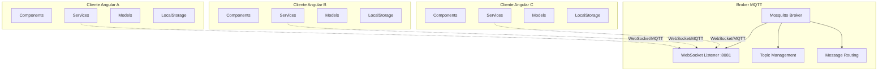
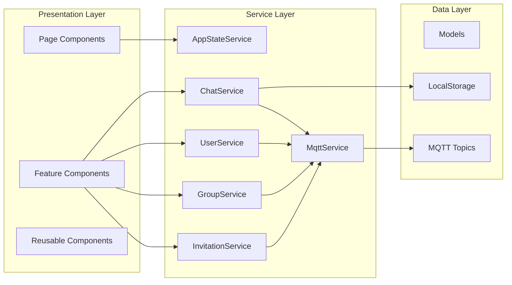
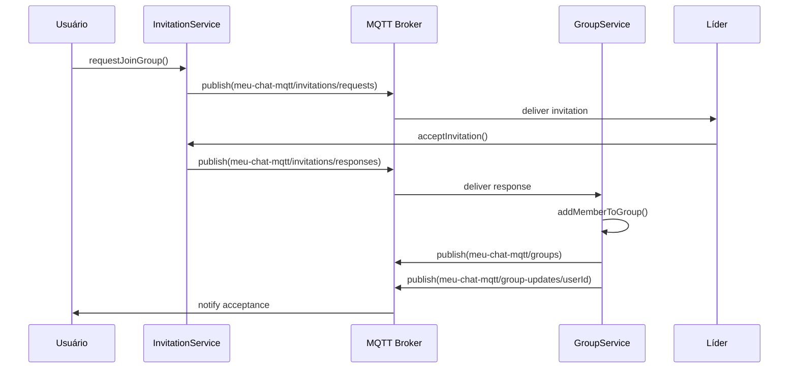

# ARQUITETURA DO SISTEMA MQTT CHAT

## Visão Geral da Arquitetura



## Diagrama de Componentes



## Fluxo de Dados - Mensagem Individual


## Fluxo de Dados - Convite de Grupo



## Estrutura de Tópicos MQTT

```
meu-chat-mqtt/
├── status                          # Status online/offline dos usuários
├── messages/
│   ├── {userId}                   # Mensagens individuais para cada usuário
│   └── groups                     # Mensagens de grupo (broadcast)
├── groups                         # Informações dos grupos (CRUD)
├── invitations/
│   ├── requests                   # Solicitações de entrada em grupos
│   └── responses                  # Respostas aos convites
└── group-updates/
    └── {userId}                   # Notificações específicas por usuário
```

## Padrões de Design Implementados

### 1. Observer Pattern
```typescript
// BehaviorSubject para estado reativo
private messagesSubject = new BehaviorSubject<Message[]>([])
public messages$ = this.messagesSubject.asObservable()

// Componentes se inscrevem para mudanças
this.chatService.messages$.subscribe(messages => {
  this.messages = messages
})
```

### 2. Publisher-Subscriber Pattern
```typescript
// MQTT como message broker
this.mqttService.subscribe('meu-chat-mqtt/messages/groups', (message) => {
  this.handleGroupMessage(message)
})

this.mqttService.publish('meu-chat-mqtt/messages/groups', JSON.stringify(payload))
```

### 3. Singleton Pattern
```typescript
// Serviços Angular são singletons por padrão
@Injectable({
  providedIn: 'root'  // Singleton em toda a aplicação
})
export class ChatService { }
```

### 4. Factory Pattern
```typescript
// Factory para criar mensagens
createMessage(sender: User, content: string, chatType: ChatType, chatId: string): Message {
  return new Message(
    this.generateId(),
    sender,
    content,
    new Date(),
    chatType,
    chatId
  )
}
```

## Gerenciamento de Estado

### Estado Global (AppStateService)
```typescript
interface AppState {
  user: User | null
  selectedChat: SelectedChat | null
  isConnected: boolean
  notifications: Notification[]
}
```

### Estado Local (Componentes)
```typescript
interface ChatContainerState {
  messages: Message[]
  inputMessage: string
  isLoading: boolean
  users: User[]
  groups: Group[]
}
```

### Persistência (LocalStorage)
```typescript
// Chaves de armazenamento
const STORAGE_KEYS = {
  MESSAGES: 'mqtt-chat-messages',
  USER: 'mqtt-chat-user',
  GROUPS: 'mqtt-chat-groups',
  PENDING_MESSAGES: 'mqtt-chat-pending-messages'
}
```

## Tratamento de Erros e Resilência

### Estratégias de Reconexão
```typescript
class MqttService {
  private reconnectAttempts = 0
  private maxReconnectAttempts = 5
  private reconnectDelay = 1000
  
  private handleConnectionLost() {
    if (this.reconnectAttempts < this.maxReconnectAttempts) {
      setTimeout(() => {
        this.reconnect()
        this.reconnectAttempts++
        this.reconnectDelay *= 2 // Exponential backoff
      }, this.reconnectDelay)
    }
  }
}
```

### Validação de Dados
```typescript
private validateMessage(data: any): boolean {
  return data &&
         typeof data.id === 'string' &&
         typeof data.sender === 'string' &&
         typeof data.content === 'string' &&
         typeof data.timestamp === 'string' &&
         ['user', 'group'].includes(data.chatType)
}
```

### Queue de Mensagens Offline
```typescript
private messageQueue: QueuedMessage[] = []

publish(topic: string, message: string): boolean {
  if (!this.isConnected()) {
    this.messageQueue.push({ topic, message, timestamp: new Date() })
    return false
  }
  
  // Processar queue quando reconectar
  this.processMessageQueue()
  return this.sendMessage(topic, message)
}
```

## Otimizações de Performance

### Lazy Loading de Módulos
```typescript
const routes: Routes = [
  {
    path: 'chat',
    loadChildren: () => import('./features/chat/chat.module').then(m => m.ChatModule)
  },
  {
    path: 'groups',
    loadChildren: () => import('./features/groups/groups.module').then(m => m.GroupsModule)
  }
]
```

### OnPush Change Detection
```typescript
@Component({
  selector: 'app-chat-container',
  changeDetection: ChangeDetectionStrategy.OnPush
})
export class ChatContainerComponent {
  // Otimização de detecção de mudanças
}
```

### Virtual Scrolling para Mensagens
```typescript
// Para listas grandes de mensagens
<cdk-virtual-scroll-viewport itemSize="50" class="message-viewport">
  <div *cdkVirtualFor="let message of messages">
    <app-message [message]="message"></app-message>
  </div>
</cdk-virtual-scroll-viewport>
```

### Debounce para Busca
```typescript
searchControl = new FormControl()

ngOnInit() {
  this.searchControl.valueChanges.pipe(
    debounceTime(300),
    distinctUntilChanged()
  ).subscribe(searchTerm => {
    this.filterUsers(searchTerm)
  })
}
```

## Segurança e Validação

### Sanitização de Entrada
```typescript
sanitizeMessage(content: string): string {
  return content
    .trim()
    .replace(/<script\b[^<]*(?:(?!<\/script>)<[^<]*)*<\/script>/gi, '')
    .substring(0, 1000) // Limite de caracteres
}
```

### Validação de Usuário
```typescript
validateUser(user: any): boolean {
  return user &&
         typeof user.id === 'string' &&
         user.id.length > 0 &&
         user.id.length <= 50 &&
         /^[a-zA-Z0-9_-]+$/.test(user.id)
}
```

### Rate Limiting
```typescript
private messageRateLimit = new Map<string, number[]>()
private readonly MAX_MESSAGES_PER_MINUTE = 30

private checkRateLimit(userId: string): boolean {
  const now = Date.now()
  const userMessages = this.messageRateLimit.get(userId) || []
  
  // Remove mensagens antigas (> 1 minuto)
  const recentMessages = userMessages.filter(time => now - time < 60000)
  
  if (recentMessages.length >= this.MAX_MESSAGES_PER_MINUTE) {
    return false
  }
  
  recentMessages.push(now)
  this.messageRateLimit.set(userId, recentMessages)
  return true
}
```

## Monitoramento e Logs

### Sistema de Logs Estruturados
```typescript
enum LogLevel {
  DEBUG = 0,
  INFO = 1,
  WARN = 2,
  ERROR = 3
}

class Logger {
  private logLevel = LogLevel.INFO
  
  debug(message: string, data?: any) {
    if (this.logLevel <= LogLevel.DEBUG) {
      console.log(`[DEBUG] ${new Date().toISOString()} - ${message}`, data)
    }
  }
  
  info(message: string, data?: any) {
    if (this.logLevel <= LogLevel.INFO) {
      console.info(`[INFO] ${new Date().toISOString()} - ${message}`, data)
    }
  }
}
```

### Métricas de Performance
```typescript
class PerformanceMonitor {
  private metrics = new Map<string, number[]>()
  
  measureTime<T>(operation: string, fn: () => T): T {
    const start = performance.now()
    const result = fn()
    const duration = performance.now() - start
    
    this.recordMetric(operation, duration)
    return result
  }
  
  private recordMetric(operation: string, duration: number) {
    const times = this.metrics.get(operation) || []
    times.push(duration)
    
    // Manter apenas últimas 100 medições
    if (times.length > 100) {
      times.shift()
    }
    
    this.metrics.set(operation, times)
  }
}
```

## Testes e Qualidade

### Estrutura de Testes
```
src/
├── app/
│   ├── services/
│   │   ├── chat.service.ts
│   │   └── chat.service.spec.ts
│   ├── components/
│   │   ├── chat-container/
│   │   │   ├── chat-container.component.ts
│   │   │   └── chat-container.component.spec.ts
│   └── models/
│       ├── message.model.ts
│       └── message.model.spec.ts
```

### Mocks para MQTT
```typescript
class MockMqttService {
  private callbacks = new Map<string, Function[]>()
  
  subscribe(topic: string, callback: Function) {
    if (!this.callbacks.has(topic)) {
      this.callbacks.set(topic, [])
    }
    this.callbacks.get(topic)!.push(callback)
  }
  
  publish(topic: string, message: string) {
    const callbacks = this.callbacks.get(topic) || []
    callbacks.forEach(callback => callback(message))
  }
}
```

Esta arquitetura garante escalabilidade, manutenibilidade e robustez do sistema MQTT Chat, seguindo as melhores práticas de desenvolvimento Angular e padrões de arquitetura de software.
