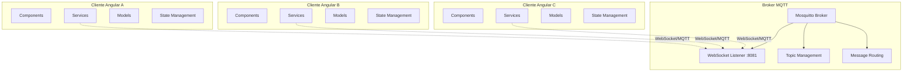
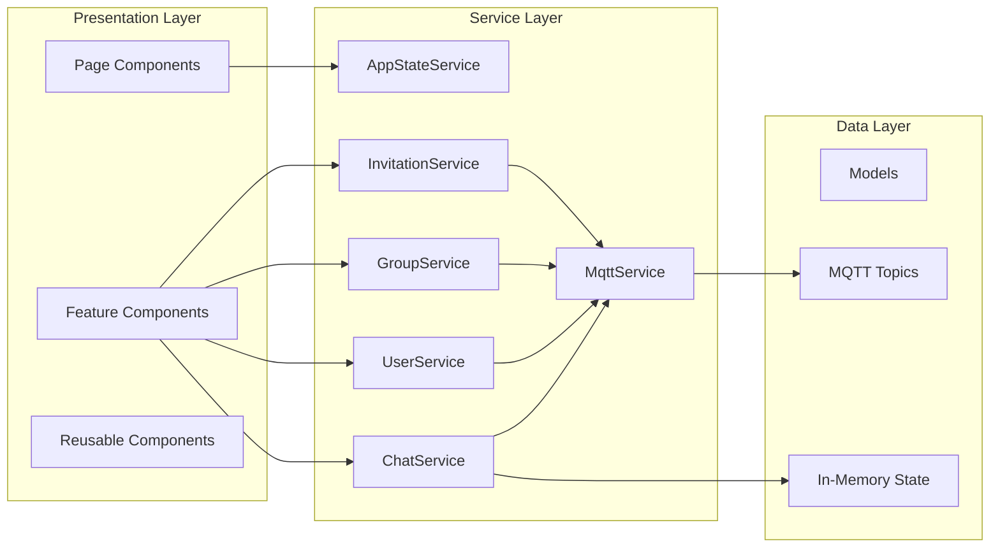
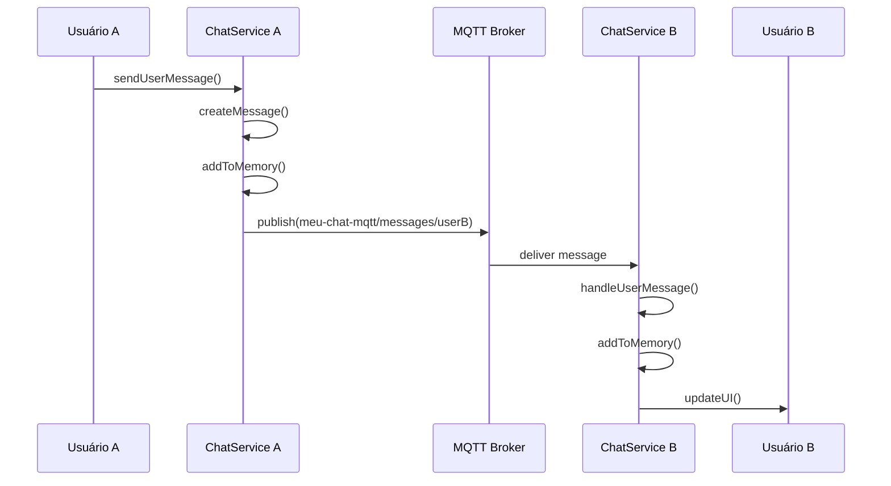
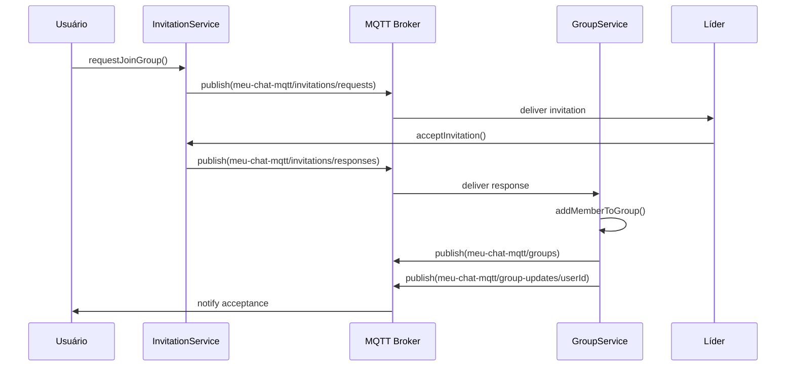

# ARQUITETURA DO SISTEMA MQTT CHAT

## Visão Geral da Arquitetura



## Diagrama de Componentes



## Fluxo de Dados - Mensagem Individual



## Fluxo de Dados - Convite de Grupo



## Estrutura de Tópicos MQTT

```
meu-chat-mqtt/
├── status                        # Status online/offline dos usuários
├── messages/
│   ├── {userId}                  # Mensagens individuais para cada usuário
│   └── groups                    # Mensagens de grupo (broadcast)
├── groups                        # Informações e atualizações de grupos
├── invitations/
│   ├── requests                  # Solicitações de entrada em grupos
│   └── responses                 # Respostas aos convites
└── group-updates/
    └── {userId}                  # Notificações específicas por usuário
```

## Padrões de Design Implementados

### 1. Observer Pattern
```typescript
// BehaviorSubject para estado reativo
private messagesSubject = new BehaviorSubject<Message[]>([])
public messages$ = this.messagesSubject.asObservable()

// Componentes se inscrevem para mudanças
this.chatService.messages$.subscribe(messages => {
  this.messages = messages
})
```

### 2. Publisher-Subscriber Pattern
```typescript
// MQTT como message broker
this.mqttService.subscribe('meu-chat-mqtt/messages/groups', (message) => {
  this.handleGroupMessage(message)
})

this.mqttService.publish('meu-chat-mqtt/messages/groups', JSON.stringify(payload))
```

### 3. Singleton Pattern
```typescript
// Serviços Angular são singletons por padrão
@Injectable({
  providedIn: 'root'  // Singleton em toda a aplicação
})
export class ChatService { }
```

### 4. Factory Pattern
```typescript
// Factory para criar mensagens
createMessage(sender: User, content: string, chatType: ChatType, chatId: string): Message {
  return new Message(
    this.generateId(),
    sender,
    content,
    new Date(),
    chatType,
    chatId
  )
}
```

## Gerenciamento de Estado

### Estado Global (AppStateService)
```typescript
interface AppState {
  user: User | null
  selectedChat: SelectedChat | null
  isConnected: boolean
  notifications: Notification[]
}
```

### Estado Local (Componentes)
```typescript
interface ChatContainerState {
  messages: Message[]
  inputMessage: string
  isLoading: boolean
  users: User[]
  groups: Group[]
}
```

### Gerenciamento de Memória
```typescript
// Estado mantido em BehaviorSubjects durante a sessão
// Sincronização via MQTT com QoS 1 e cleanSession: false
// Dados são recuperados automaticamente na reconexão
private messagesSubject = new BehaviorSubject<Message[]>([])
private groupsSubject = new BehaviorSubject<Group[]>([])
private usersSubject = new BehaviorSubject<User[]>([])
```

## Tratamento de Erros e Resilência

### Reconexão Automática
```typescript
// Tratamento de perda de conexão
this.client.onConnectionLost = () => {
  this.client = null
  setTimeout(() => {
    this.reconnect()
  }, 2000)
}

// Método de reconexão
private reconnect() {
  if (!this.client && this.currentClientId) {
    this.connect(this.currentClientId).catch(() => {
      setTimeout(() => this.reconnect(), 5000)
    })
  }
}
```

### Reinscrição em Tópicos
```typescript
// Reinscreve em todos os tópicos após reconexão
private resubscribeAll() {
  this.messageCallbacks.forEach((callbacks, topic) => {
    if (this.client && this.client.isConnected()) {
      this.client.subscribe(topic, { qos: 1 })
    }
  })
}
```

### Publicação com Tratamento de Erro
```typescript
publish(topic: string, message: string, retained: boolean = false, qos: 0 | 1 | 2 = 1): boolean {
  if (!this.client || !this.client.isConnected()) {
    return false
  }

  try {
    const mqttMessage = new Paho.Message(message)
    mqttMessage.destinationName = topic
    mqttMessage.retained = retained
    mqttMessage.qos = qos
    this.client.send(mqttMessage)
    return true
  } catch (error) {
    console.error('Failed to publish message:', error)
    return false
  }
}
```

## Otimizações Implementadas

### Gerenciamento Eficiente de Estado
```typescript
private messagesSubject = new BehaviorSubject<Message[]>([])
public messages$ = this.messagesSubject.asObservable()

this.chatService.messages$.subscribe(messages => {
  this.messages = messages
})
```

### Configuração MQTT Otimizada
```typescript
const options = {
  cleanSession: false,
  reconnectPeriod: 1000,
  connectTimeout: 30000
}
```

## Sistema de Logs

### Logs de Debug
```typescript
// Logs estruturados para rastreamento
console.log('Enviando mensagem para grupo:', groupId, 'de:', from.id)
console.log('Recebendo mensagem de grupo:', message)
console.log('Inscrevendo no tópico:', topic)
console.log('Publicando via MQTT:', payload)

// Logs de erro
console.error('MQTT não conectado')
console.error('Erro ao publicar mensagem:', error)
```

## Resumo da Arquitetura

Esta arquitetura implementa um sistema de chat em tempo real utilizando:

- **Protocolo MQTT** com biblioteca Paho MQTT 1.1.0
- **BehaviorSubjects** para gerenciamento de estado reativo em memória
- **Padrões de design** (Observer, Publisher-Subscriber, Singleton, Factory)
- **QoS 1** para entrega garantida de mensagens
- **cleanSession: false** para manter estado entre reconexões
- **Reconexão automática** com retry progressivo (2s → 5s)
- **Reinscrição automática** em tópicos após reconexão
- **Logs estruturados** para debug e monitoramento

O sistema mantém estado consistente entre clientes e garante entrega confiável de mensagens através do protocolo MQTT.
