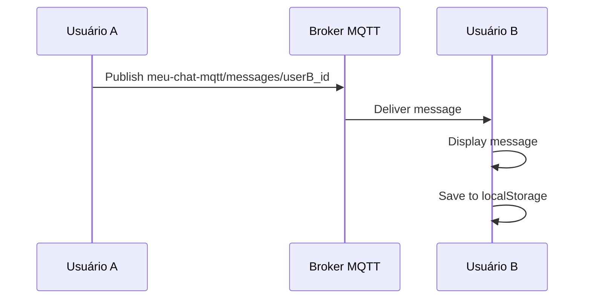
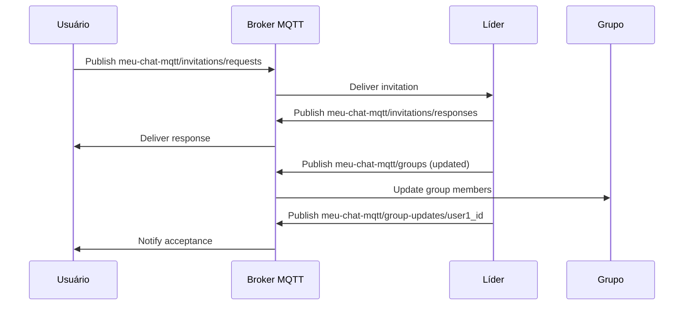

# RELATÓRIO TÉCNICO - APLICAÇÃO MQTT CHAT

---

## FOLHA DE ROSTO

**Universidade:** [Nome da Universidade]  
**Disciplina:** GEX635 - TÓPICOS ESPECIAIS EM COMPUTAÇÃO XIII (60h)  
**Turma:** 01 (2025.2)  
**Professor:** [Nome do Professor]  

**Trabalho:** Desenvolvimento de Aplicação de Chat com Protocolo MQTT  
**Autor:** Débora Rebelatto  
**Data:** 08 de Outubro de 2025  

---

## 1. DESCRIÇÃO DO PROJETO

### 1.1 Objetivo
Desenvolver uma aplicação de "bate-papo" (chat) utilizando exclusivamente o protocolo MQTT para comunicação, implementando funcionalidades de comunicação um-a-um e em grupo com persistência de dados para usuários offline.

### 1.2 Escopo
O projeto implementa um sistema de chat distribuído com as seguintes características:
- **Comunicação bidirecional** entre usuários
- **Grupos de chat** com sistema de convites
- **Persistência de mensagens** para usuários offline
- **Interface web moderna** e responsiva
- **Gerenciamento de status** online/offline

### 1.3 Tecnologias Utilizadas
- **Frontend:** Angular 20.3.0 com TypeScript
- **Protocolo:** MQTT via biblioteca Paho MQTT 1.1.0
- **Broker:** Mosquitto com suporte WebSockets
- **UI:** TailwindCSS + Lucide Icons
- **Persistência:** LocalStorage do navegador

---

## 2. ARQUITETURA DO SISTEMA

### 2.1 Visão Geral
```
┌─────────────────┐    MQTT/WebSocket    ┌─────────────────┐
│   Cliente A     │◄────────────────────►│   Broker MQTT   │
│   (Angular)     │     (localhost:8081) │   (Mosquitto)   │
└─────────────────┘                      └─────────────────┘
                                                   ▲
                                                   │ MQTT/WebSocket
                                                   ▼
┌─────────────────┐                      ┌─────────────────┐
│   Cliente B     │◄────────────────────►│   Cliente C     │
│   (Angular)     │    Via Broker MQTT   │   (Angular)     │
└─────────────────┘                      └─────────────────┘
```

### 2.2 Componentes Principais

#### 2.2.1 Camada de Apresentação
- **Components:** Componentes Angular reutilizáveis
- **Features:** Módulos funcionais (Chat, Groups, Users)
- **UI:** Interface responsiva com TailwindCSS

#### 2.2.2 Camada de Serviços
- **MqttService:** Gerenciamento de conexão MQTT
- **ChatService:** Lógica de mensagens e conversas
- **UserService:** Gerenciamento de usuários
- **GroupService:** Operações de grupos
- **InvitationService:** Sistema de convites

#### 2.2.3 Camada de Dados
- **Models:** Classes TypeScript para entidades
- **LocalStorage:** Persistência local de dados
- **MQTT Topics:** Canais de comunicação distribuída

---

## 3. DEFINIÇÃO E FORMATO DOS TÓPICOS

### 3.1 Tópicos de Controle Implementados

#### 3.1.1 Status de Usuários
**Tópico:** `meu-chat-mqtt/status`  
**Propósito:** Comunicar status online/offline dos usuários  
**QoS:** 0 (At most once)  
**Retained:** true (para persistir último status)

**Formato da Mensagem:**
```json
{
  "id": "string",           // ID único do usuário
  "name": "string",         // Nome de exibição
  "online": boolean,        // Status online/offline
  "lastSeen": "ISO8601"     // Timestamp da última atividade
}
```

#### 3.1.2 Mensagens Individuais
**Tópico:** `meu-chat-mqtt/messages/{userId}`  
**Propósito:** Comunicação um-a-um entre usuários  
**QoS:** 1 (At least once)  
**Retained:** false

**Formato da Mensagem:**
```json
{
  "id": "string",           // ID único da mensagem
  "sender": "string",       // ID do remetente
  "content": "string",      // Conteúdo da mensagem
  "timestamp": "ISO8601",   // Timestamp de envio
  "chatId": "string",       // ID do destinatário
  "chatType": "user"        // Tipo de chat
}
```

#### 3.1.3 Mensagens de Grupo
**Tópico:** `meu-chat-mqtt/messages/groups`  
**Propósito:** Comunicação em grupo  
**QoS:** 1 (At least once)  
**Retained:** false

**Formato da Mensagem:**
```json
{
  "id": "string",           // ID único da mensagem
  "sender": "string",       // ID do remetente
  "content": "string",      // Conteúdo da mensagem
  "timestamp": "ISO8601",   // Timestamp de envio
  "chatId": "string",       // ID do grupo
  "chatType": "group"       // Tipo de chat
}
```

#### 3.1.4 Informações de Grupos
**Tópico:** `meu-chat-mqtt/groups`  
**Propósito:** Publicar informações dos grupos  
**QoS:** 1 (At least once)  
**Retained:** true (para persistir estado dos grupos)

**Formato da Mensagem:**
```json
{
  "id": "string",           // ID único do grupo
  "name": "string",         // Nome do grupo
  "leader": {               // Líder do grupo
    "id": "string",
    "name": "string",
    "online": boolean
  },
  "members": [              // Lista de membros
    {
      "id": "string",
      "name": "string",
      "online": boolean,
      "lastSeen": "ISO8601"
    }
  ],
  "createdAt": "ISO8601"    // Data de criação
}
```

#### 3.1.5 Sistema de Convites
**Tópico Solicitação:** `meu-chat-mqtt/invitations/requests`  
**Tópico Resposta:** `meu-chat-mqtt/invitations/responses`  
**QoS:** 1 (At least once)  
**Retained:** false

**Formato Solicitação:**
```json
{
  "id": "string",           // ID único do convite
  "groupId": "string",      // ID do grupo
  "groupName": "string",    // Nome do grupo
  "invitee": {              // Usuário solicitante
    "id": "string",
    "name": "string",
    "online": boolean
  },
  "leader": {               // Líder do grupo
    "id": "string",
    "name": "string"
  },
  "timestamp": "ISO8601"
}
```

**Formato Resposta:**
```json
{
  "invitationId": "string", // ID do convite original
  "groupId": "string",      // ID do grupo
  "invitee": {              // Usuário aceito/rejeitado
    "id": "string",
    "name": "string",
    "online": boolean,
    "lastSeen": "ISO8601"
  },
  "accepted": boolean,      // true = aceito, false = rejeitado
  "timestamp": "ISO8601"
}
```

#### 3.1.6 Notificações Específicas
**Tópico:** `meu-chat-mqtt/group-updates/{userId}`  
**Propósito:** Notificar usuários específicos sobre mudanças  
**QoS:** 1 (At least once)  
**Retained:** false

**Formato da Mensagem:**
```json
{
  "type": "string",         // Tipo: "member_added", "member_removed"
  "groupId": "string",      // ID do grupo
  "groupName": "string",    // Nome do grupo
  "newMember": {            // Membro adicionado/removido
    "id": "string",
    "name": "string"
  },
  "timestamp": "ISO8601"
}
```

### 3.2 Fluxos de Comunicação

#### 3.2.1 Fluxo de Mensagem Individual


#### 3.2.2 Fluxo de Convite de Grupo


---

## 4. PRINCIPAIS ASPECTOS DA IMPLEMENTAÇÃO

### 4.1 Padrões Arquiteturais

#### 4.1.1 Service-Oriented Architecture (SOA)
- **Separação de responsabilidades** em serviços especializados
- **Injeção de dependência** do Angular para acoplamento fraco
- **Observables RxJS** para programação reativa

#### 4.1.2 Publisher-Subscriber Pattern
- **MQTT como message broker** para desacoplamento
- **Event-driven architecture** para atualizações em tempo real
- **Asynchronous communication** entre componentes

#### 4.1.3 Model-View-ViewModel (MVVM)
- **Models:** Classes TypeScript para entidades de domínio
- **Views:** Templates Angular com data binding
- **ViewModels:** Componentes Angular com lógica de apresentação

### 4.2 Gerenciamento de Estado

#### 4.2.1 AppStateService
```typescript
@Injectable({ providedIn: 'root' })
export class AppStateService {
  private userSubject = new BehaviorSubject<User | null>(null)
  private selectedChatSubject = new BehaviorSubject<SelectedChat | null>(null)
  
  public user$ = this.userSubject.asObservable()
  public selectedChat$ = this.selectedChatSubject.asObservable()
}
```

#### 4.2.2 Persistência Local
- **LocalStorage** para mensagens e configurações
- **Serialização/Deserialização** automática de objetos
- **Sincronização** entre abas do navegador

### 4.3 Tratamento de Erros e Reconexão

#### 4.3.1 Estratégias de Resilência
```typescript
publish(topic: string, message: string): boolean {
  if (!this.client || !this.client.isConnected()) {
    console.warn('MQTT client not connected. Message queued.')
    this.queueMessage(topic, message)
    return false
  }
  
  try {
    const mqttMessage = new Paho.Message(message)
    mqttMessage.destinationName = topic
    this.client.send(mqttMessage)
    return true
  } catch (error) {
    console.error('Failed to publish message:', error)
    return false
  }
}
```

#### 4.3.2 Reconexão Automática
- **Detecção de desconexão** via callbacks do Paho
- **Tentativas de reconexão** com backoff exponencial
- **Resubscrição automática** aos tópicos após reconexão

### 4.4 Otimizações de Performance

#### 4.4.1 Lazy Loading
- **Módulos carregados sob demanda** para reduzir bundle inicial
- **Componentes lazy** para melhor performance

#### 4.4.2 Change Detection Strategy
```typescript
@Component({
  changeDetection: ChangeDetectionStrategy.OnPush
})
export class ChatContainerComponent {
  // Otimização de detecção de mudanças
}
```

#### 4.4.3 Virtual Scrolling
- **Virtualização de listas** para grandes volumes de mensagens
- **Paginação** de histórico de conversas

---

## 5. FUNCIONALIDADES IMPLEMENTADAS

### 5.1 Etapa 1 - Interface e Controles Básicos ✅

#### 5.1.1 Interface Amigável
- **Design responsivo** com TailwindCSS
- **Sidebar navegável** com seções organizadas
- **Tema moderno** com dark/light mode
- **Ícones intuitivos** da biblioteca Lucide

#### 5.1.2 Listagem de Usuários
- **Status visual** online/offline com indicadores coloridos
- **Atualização em tempo real** via MQTT
- **Busca e filtros** para encontrar usuários
- **Click-to-chat** para iniciar conversas

#### 5.1.3 Gerenciamento de Grupos
- **Formulário de criação** com validação
- **Lista de grupos** com informações detalhadas
- **Indicação de líder** e contagem de membros
- **Estados visuais** para grupos disponíveis/participando

#### 5.1.4 Sistema de Solicitações
- **Painel de notificações** com badge de contagem
- **Histórico de convites** enviados e recebidos
- **Ações de aceitar/rejeitar** com feedback visual
- **Debug logs** para rastreamento de solicitações

### 5.2 Etapa 2 - Comunicação Completa ✅

#### 5.2.1 Chat Individual
- **Interface de conversa** com histórico
- **Envio em tempo real** via MQTT
- **Indicadores de status** (enviado, entregue)
- **Persistência** de conversas no localStorage

#### 5.2.2 Chat em Grupo
- **Comunicação multicast** para todos os membros
- **Identificação de remetente** em cada mensagem
- **Sincronização** entre todos os clientes
- **Gerenciamento de membros** dinâmico

#### 5.2.3 Recursos Avançados
- **Timestamps** em todas as mensagens
- **Scroll automático** para novas mensagens
- **Notificações** de novas mensagens
- **Contadores de mensagens não lidas**

---

## 6. DESAFIOS ENFRENTADOS E SOLUÇÕES

### 6.1 Problema: Mensagens Não Chegavam ao Destinatário
**Sintoma:** Usuário enviava mensagem para si mesmo ao invés do destinatário

**Causa Raiz:**
```typescript
// ❌ CÓDIGO PROBLEMÁTICO
this.appState.selectChat(ChatType.User, user.name, user.name)
this.chatService.setCurrentChat(ChatType.User, user.name)
```

**Solução Implementada:**
```typescript
// ✅ CÓDIGO CORRIGIDO
this.appState.selectChat(ChatType.User, user.id, user.name)
this.chatService.setCurrentChat(ChatType.User, user.id)
```

**Impacto:** Mensagens agora são entregues corretamente ao destinatário

### 6.2 Problema: Convites de Grupo Falhavam
**Sintoma:** Usuários aceitos não apareciam na lista de membros

**Causa Raiz:**
```typescript
// ❌ ESTRUTURA INCORRETA
const joinRequest = new GroupInvitation(id, groupId, groupName, leader, timestamp)
```

**Solução Implementada:**
```typescript
// ✅ ESTRUTURA CORRETA
const joinRequest = new GroupInvitation(id, groupId, groupName, requester, timestamp)
```

**Impacto:** Sistema de convites funciona completamente

### 6.3 Problema: Perda de Mensagens Após Reload
**Sintoma:** Mensagens desapareciam ao recarregar a página

**Solução Implementada:**
```typescript
private readonly MESSAGES_STORAGE_KEY = 'mqtt-chat-messages'

private saveMessagesToStorage(messages: Message[]) {
  const serialized = messages.map(m => ({
    ...m,
    sender: { ...m.sender },
    timestamp: m.timestamp.toISOString()
  }))
  localStorage.setItem(this.MESSAGES_STORAGE_KEY, JSON.stringify(serialized))
}

private loadMessagesFromStorage() {
  const stored = localStorage.getItem(this.MESSAGES_STORAGE_KEY)
  if (stored) {
    const parsed = JSON.parse(stored)
    const messages = parsed.map(m => new Message(
      m.id, new User(m.sender.id, m.sender.name), m.content,
      new Date(m.timestamp), m.chatType, m.chatId
    ))
    this.messagesSubject.next(messages)
  }
}
```

**Impacto:** Persistência completa de conversas

### 6.4 Problema: Sincronização de Grupos
**Sintoma:** Lista de grupos não atualizava após aceitar membros

**Solução Implementada:**
```typescript
// Sistema de notificações específicas por usuário
setCurrentUser(user: User) {
  this.currentUser = user
  if (user) {
    this.mqttService.subscribe(`meu-chat-mqtt/group-updates/${user.id}`, (message) => {
      this.handleGroupUpdate(message)
    })
  }
}
```

**Impacto:** Sincronização perfeita entre todos os clientes

### 6.5 Problema: Erros de Conexão MQTT
**Sintoma:** "AMQJS0011E Invalid state not connected"

**Solução Implementada:**
```typescript
publish(topic: string, message: string): boolean {
  if (!this.client || !this.client.isConnected()) {
    console.warn('MQTT client not connected')
    return false
  }
  
  try {
    const mqttMessage = new Paho.Message(message)
    mqttMessage.destinationName = topic
    this.client.send(mqttMessage)
    return true
  } catch (error) {
    console.error('Failed to publish:', error)
    return false
  }
}
```

**Impacto:** Tratamento robusto de erros de conexão

---

## 7. INSTALAÇÃO E USO

**Ver `README.md` e `MANUAL_USUARIO.md` para instruções completas.**

---

## 8. CONCLUSÕES

### 8.1 Objetivos Alcançados
- ✅ Comunicação um-a-um via MQTT
- ✅ Comunicação em grupo
- ✅ Sistema de convites
- ✅ Interface responsiva
- ✅ Sincronização em tempo real

### 8.2 Aprendizados
- Gerenciamento de estado em aplicações distribuídas
- Sincronização entre múltiplos clientes via MQTT
- Tratamento de reconexões e erros
- Programação reativa com RxJS

### 8.3 Trabalhos Futuros
- Criptografia end-to-end
- Compartilhamento de arquivos
- Melhorias de escalabilidade

---

**Data:** 28 de Outubro de 2025  
**Status:** Concluído ✅
